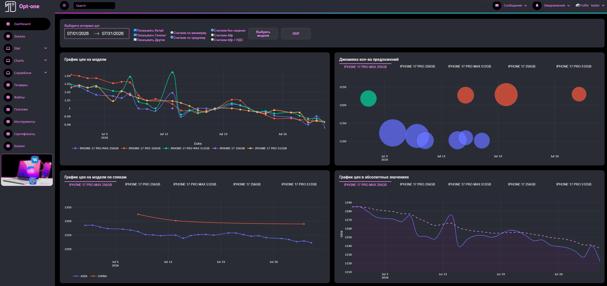
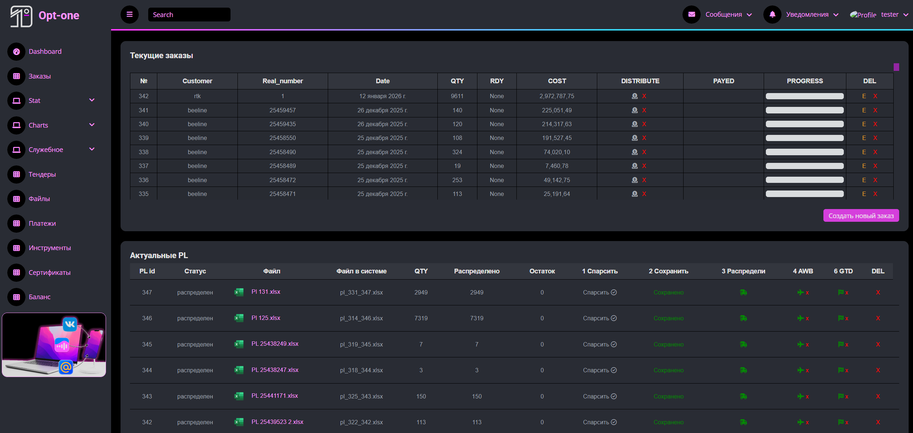
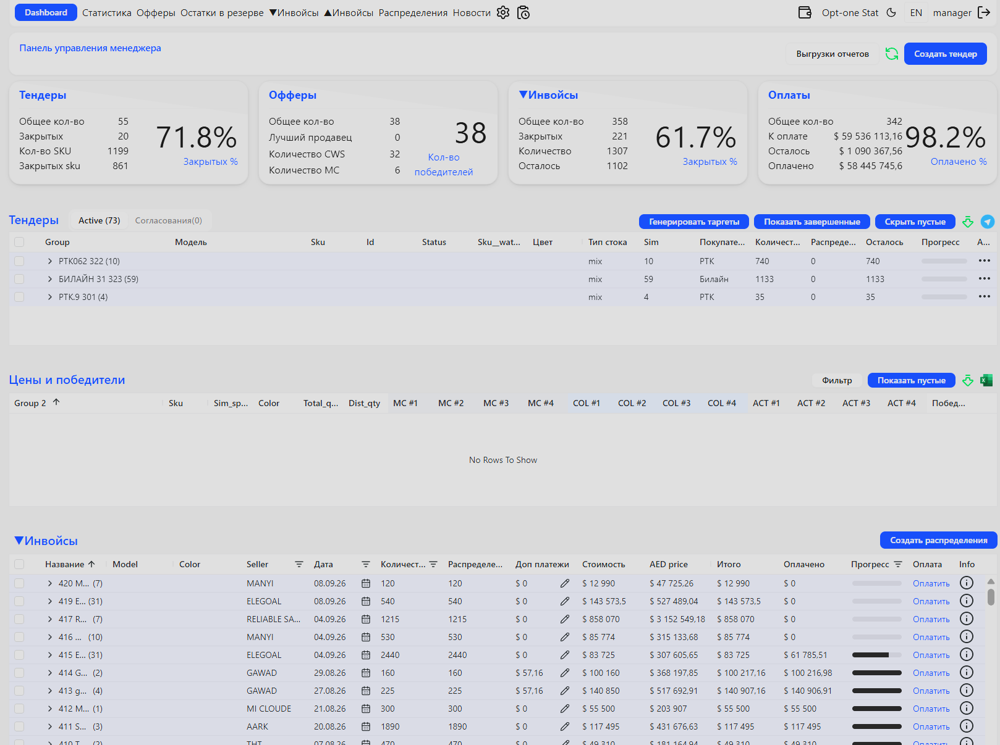
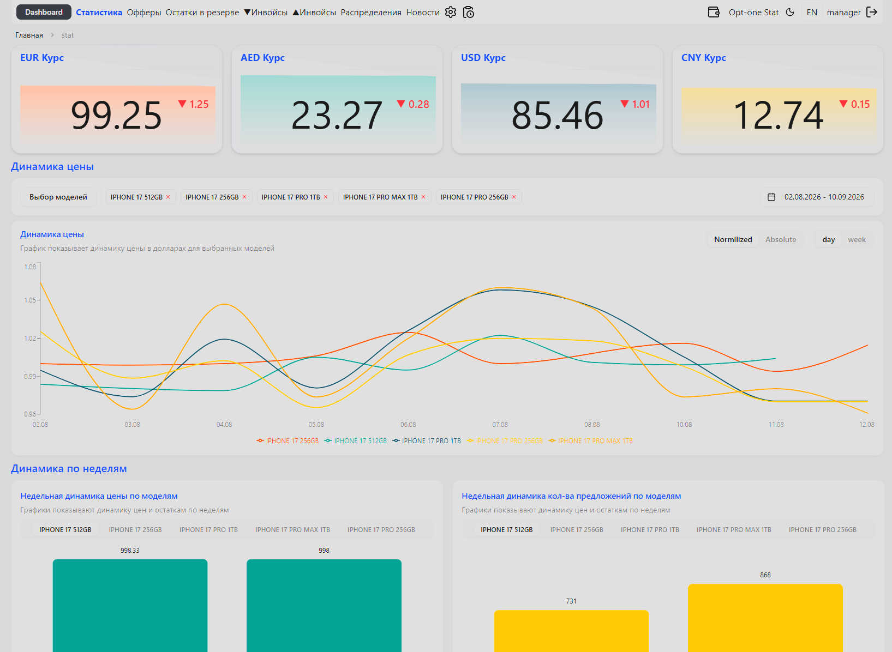

# Александр Тропинский

### **Team Lead | System Architect | Full-Stack & Mobile Engineer**

---

### 👨‍💻 Обо мне

Выпускник **Московского Энергетического Института (МЭИ, АВТИ)** по направлению автоматики и вычислительной техники.

Мой профессиональный бэкграунд сочетает **7 лет управленческого опыта** и **6+ лет глубокой инженерной и аналитической экспертизы**. Как **Team Lead и System Architect**, я соединяю бизнес-цели и техническую реализацию:

- Проектирую масштабируемую архитектуру распределенных веб- и мобильных систем (**FastAPI, Next.js, Django, Swift / iOS**).
- Выстраиваю эффективные процессы разработки в команде, CI/CD пайплайны и культуру надежности кода.
- Создаю корпоративные SaaS-решения, CRM, аналитические платформы и мобильные приложения с акцентом на бизнес-результат и чистый UX/UI.

---

### 🛠 Технологический стек

| Категория                     | Технологии                                                                                    |
| :---------------------------- | :-------------------------------------------------------------------------------------------- |
| **Architecture & Leadership** | System Design, Microservices, Domain-Driven Design (DDD), Agile/Scrum, Code Review, Mentoring |
| **Backend**                   | Python, FastAPI, Django, Django REST Framework, Node.js, Celery, Redis                        |
| **Frontend**                  | TypeScript, JavaScript, Next.js, React, HTML5 / SCSS, Tailwind CSS, Plotly.js                 |
| **Mobile (iOS)**              | Swift, SwiftUI, UIKit, MVVM, Clean Architecture, Combine                                      |
| **Databases & ORM**           | PostgreSQL, MySQL, SQLAlchemy, Django ORM, Redis                                              |
| **DevOps & Cloud**            | Docker, Docker Compose, GitHub Actions, CI/CD, Nginx, Linux (Ubuntu), Bash                    |
| **Data & Analytics**          | Pandas, NumPy, Scikit-learn, Matplotlib, Data Pipelines & Web Scraping                        |

---

## 🚀 Проекты

---

### 1. 💼 Opt-one.online — B2B SaaS платформа закупок, мониторинга цен и CRM

> **Роль:** System Architect / Lead Full-Stack Developer  
> **Стек:** `Python` • `Django` • `Plotly.js` • `SCSS` • `PostgreSQL` • `OAuth 2.0` • `Docker`

**Opt-one** — комплексная облачная SaaS-платформа для управления оптовыми поставками электроники, сквозного мониторинга цен и контроля бизнес-процессов дистрибуции.

#### 🌟 Ключевые возможности и архитектурные решения:

- **Price Intelligence & Analytics:** Интерактивные многомерные графики (Plotly) динамики рыночных цен, плотности предложений и аналитики маржинальности с учетом таможенных моделей (DDP, DDP с НДС, Гонконг, Китай).
- **Автоматизация обработки спецификаций (PL Parser):** Сервис парсинга и сопоставления разноформатных Excel/PL файлов в единую номенклатуру каталога.
- **Финансово-операционный CRM-контур:** Управление цепочками инвойсов, учет оплат, контроль распределения товаров и мультивалютный пересчет.
- **Безопасность и разграничение прав:** Интеграция OAuth 2.0 и гранулярная ролевая модель (RBAC) для отделов продаж, логистики и менеджмента.

 

  <table width="100%" border="0" cellspacing="0" cellpadding="0" align="center">
    <thead>
      <tr align="center">
        <th width="50%"><b>🖥 Монитор аналитики: Графики динамики цен и распределения</b></th>
        <th width="50%"><b>🖥 Монитор операционного контура: Управление заказами и PL</b></th>
      </tr>
    </thead>
    <tbody>
      <tr>
        <td align="center" valign="top" style="padding: 10px;">
          
           
          <i>Аналитика динамики цен и предложений поставщиков (Plotly)</i>
        </td>
        <td align="center" valign="top" style="padding: 10px;">
          
           
          <i>Управление заказами, инвойсами и статусами автопарсинга PL</i>
        </td>
      </tr>
    </tbody>
  </table>

---

### 2. 🤝 Opt-one Partners — B2B SaaS портал партнерских закупок, тендеров и фин. учета

> **Роль:** System Architect / Lead Full-Stack Developer  
> **Стек:** `React` • `RTK Query` • `Django` • `Tailwind CSS` • `shadcn/ui` • `WebSocket` • `Celery` • `Redis` • `PostgreSQL` • `OpenRouter API` • `HttpOnly Cookie`

**Opt-one Partners** — многофункциональная SaaS-платформа для взаимодействия с B2B-партнерами, автоматизированного проведения тендеров, сбора офферов, парсинга цен и сквозного финансового учета.

#### 🌟 Ключевые возможности и архитектурные решения:

- **Тендерный модуль и управление офферами:** Проведение закупочных процедур в реальном времени, автоматический скоринг предложений поставщиков, определение победителей и распределение объемов партий.
- **Интерактивная аналитика и мультивалютный трекинг:** Мониторинг кросс-курсов валют (USD, EUR, AED, CNY) в режиме реального времени, нормализованные и абсолютные графики динамики цен по моделям, анализ плотности и структуры предложений по неделям.
- **Финансово-казначейский контур:** Контроль статусов инвойсов, балансов кошельков, поэтапных оплат, отслеживание задолженностей и автоматическое формирование распределений платежей.
- **Реактивная архитектура и высокая отзывчивость:** Real-time доставка обновлений и статусов через WebSockets, асинхронная обработка тяжелых задач (парсинг, отчеты) в фоновых воркерах Celery + Redis с многоуровневым кэшированием.
- **AI-интеграция (OpenRouter API):** Подключение LLM-моделей для интеллектуального анализа данных, обработки неструктурированных спецификаций и генерации таргетов.
- **Безопасность корпоративного уровня:** Защита сессий и токенов с использованием HttpOnly Cookie, ролевая изоляция данных и аудит действий.

 

  <table width="100%" border="0" cellspacing="0" cellpadding="0" align="center">
    <thead>
      <tr align="center">
        <th width="50%"><b>🖥 Панель управления менеджера: Тендеры, офферы и инвойсы</b></th>
        <th width="50%"><b>🖥 Монитор аналитики: Динамика цен, курсы валют и статистика</b></th>
      </tr>
    </thead>
    <tbody>
      <tr>
        <td align="center" valign="top" style="padding: 10px;">
          
           
          <i>Рабочее место менеджера: контроль тендеров, офферов, оплат и инвойсов</i>
        </td>
        <td align="center" valign="top" style="padding: 10px;">
          
           
          <i>Аналитический дашборд: курсы валют, динамика цен и объем предложений</i>
        </td>
      </tr>
    </tbody>
  </table>

---
